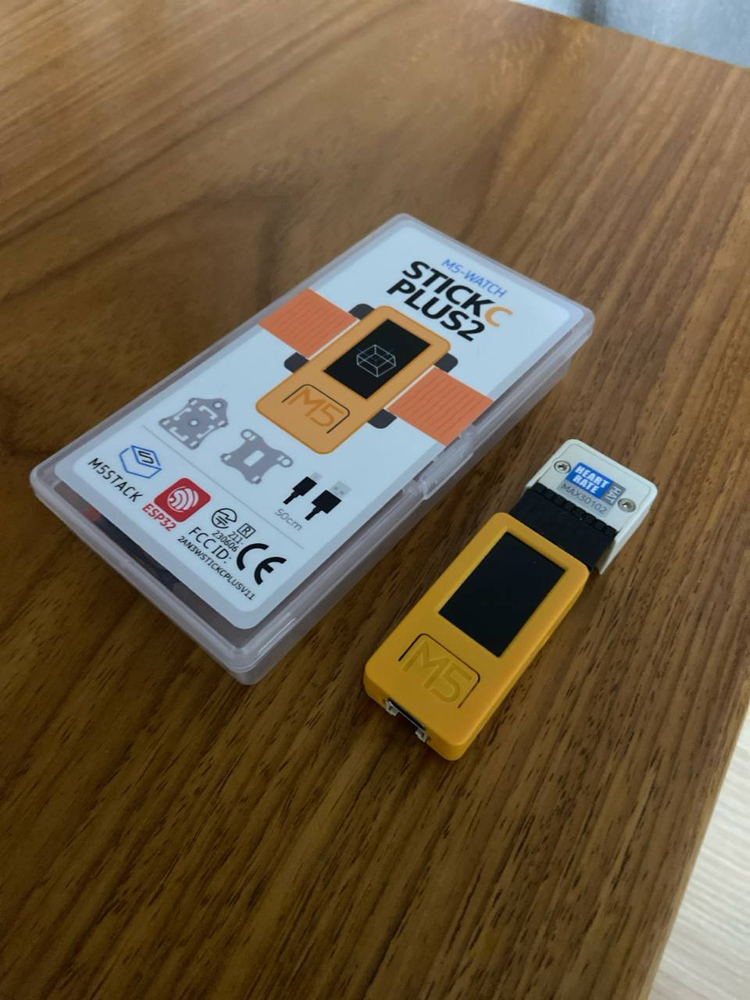

# ROLYPOLY Sensors

## Maxim

## StickCPlus2

The StickCPlus2 has

- Digital interface that can be used to show the various measurements
- Front Button (Button A), Right Button (Button B) and the Left Button (Button C)
- 8 MB of flash memory

### Using the Device
<b> Turning on the device </b>: Holding down Button B for 3 seconds will turn on the device and load the current python script (mainCode.py)

<b> Functions of mainCode.py </b>: The script does two things, recording data and sending csv to the users computer.

<b> Recording Data </b>: Begin recording data by pressing Button A and stop recording by pressing Button B. The data will be stored on the flash memory of the device which can be sent to computers later.

<b> Sending Data </b>: Connect the device to a computer using a data transfer type C cable. Start up arduino UNO and open the Serial Monitor and select the corresponding port. Turn on the device and press Button C with the device connected. The data will be logged in the serial monitor.

### Setup
Device can developed with 4 programs:
- UiFlow
- MicroPython 
- Arduino 
- .Net Nano Framework

The solution the team used was to use UIFLow, an online block based programming service to program the device. The below are applications that used for the UiFlow solution.

**M5 Burner Application** (using **UIFlow_StickC_Plus2** to erase and burn new scripts):
- [Windows](https://m5burner.m5stack.com/app/M5Burner-v3-beta-win-x64.zip)
- [MacOS](https://m5burner.m5stack.com/app/M5Burner-v3-mac-x64.dmg)
- [Linux](https://m5burner.m5stack.com/app/M5Burner-v3-beta-linux-x64.zip)

**Flow M5 Stack** (Block code builder):
- [Visit the website](https://flow.m5stack.com/)

### Programming
1. Launch M5 Burner and delete the existing program on the device
2. Press Next and configure the device to be programmable using UIFlow
3. Connect to the device on M5 stack using the api key and pressing the connection button at the bottom left side of the UI
4. Do your programming and run it on the device wireless and download when ready
